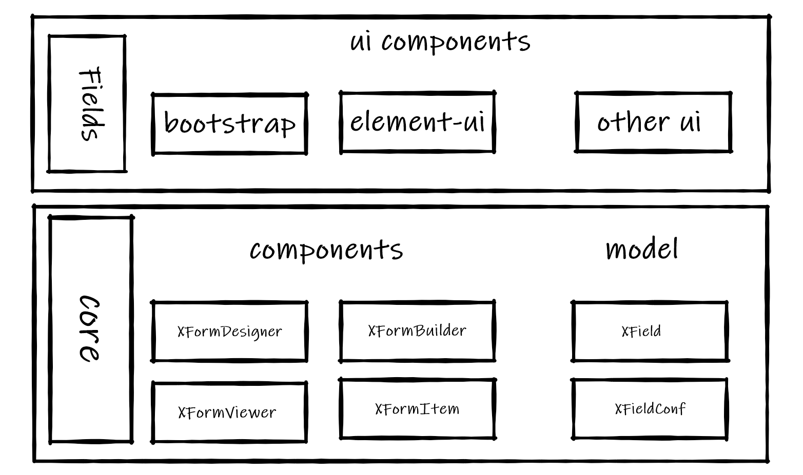

<md-meta toc="false"></md-meta>

# 介绍
**基于[Vue@3.x][vue]的动态表单生成器**，主要用于处理用户自行设计表单的业务场景。这里提供了一个[在线示例][example]更直观的展示该项目，或者可以查看[快速上手][quickstart]了解如何使用。

## 特性 ✨
- **可扩展** - 提供完善的字段扩展机制，可自行扩展字段
- **可定制** - 提供多样化的配置，让开发人员完全控制表单的行为
- 包含**表单设计**、**表单生成**、**表单展示**在内的组件库
- 可与任何UI库集成，目前已集成`Bootstrap`
- 基于`typescript`和`Vue@3.x`开发

## 架构

xForm不提供具体的字段实现，专注于提供灵活的字段扩展机制。通过将底层核心与字段的解耦，具体字段实现可以基于任意UI库，只需要满足xForm的规则即可。

考虑到xForm提供的功能与实际需求可能存在不相匹配的情况，因此在设计时就将**可扩展性**作为首要因素。为了使用户可以完全的控制表单的行为，xForm支持以下几种层级的配置：
- 全局配置(`config`) - 表单的默认行为
- 字段配置(`XField`) - 用户控制的行为
- 字段类型配置(`XFieldConf`) - 字段类型的行为
- 组件配置(`slot`) - 具体组件下的行为

通常情况下用户并不懂技术，所以xForm让开发人员通过一系列的配置控制表单行为，在屏蔽技术细节的基础上提供自定义能力供用户使用。 

简单的说，**面向普通用户隐藏技术细节，面向开发人员提供完整的控制力。**

[example]: https://dongls.github.io/xForm/example.html
[vue]: https://github.com/vuejs/vue-next
[quickstart]: /doc/quickstart